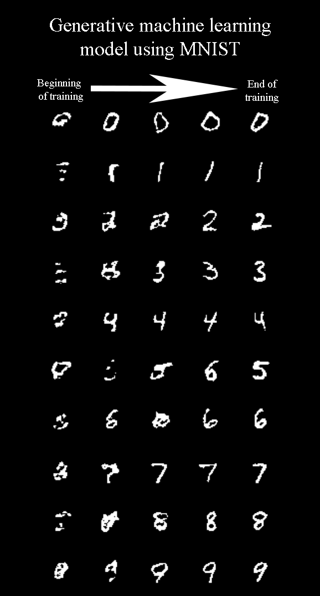

# Creating a conditional GAN using the MNIST dataset

This respository only contains one file, the ConditionalGAN_MNIST.py file. It contains the method to train a conditional GAN (generative adversarial network) on the famous MNIST dataset, which consists of images of handwritten digits between 0 and 9. 

The idea of a cGAN is that you define two models, the Generator and the Discriminator.
- The job of the Generator is to create data samples based on some random noise and a conditional input. In this project for example, you would input random noise and the number '3' (which is the condition), and it should then output an image depicting a handwritten 3.
- The job of the Discriminator, is to determine whether the image it gets as input is a Real life image, or it was generated by the Generator. 

During training of the cGAN, we alternatively train the Discriminator and the Generator, each providing input for the other. This means they are in conflict (which is the adversarial part of a GAN) and they both improve as they try to outsmart eachother.

At the end of the training, we can save the Generator model, and run it to create images that are not present in the dataset. This basic priniciple of a cGAN is used here to generate small handwritten digits (see image below), but can be used for other generative purposes as well.

Feel free to use any part of this code in your projects/work related things, I hope you gain some insight from it and look forward to seeing what you can come up with. Good luck!

